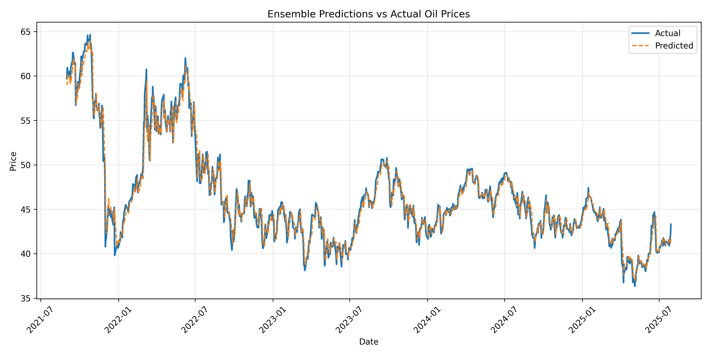

# Oil Pulse Forecast

[](bigru_predictions_plot.png)

A comprehensive oil price forecasting system using machine learning models (LSTM and BiGRU), integrated with news sentiment analysis. The backend serves predictions, sentiment scores, and news via a FastAPI server. Data spans from July 29, 2021, to July 29, 2025, focusing on the OILK symbol. The system fetches real-time oil prices and news, processes sentiment, trains models, and provides API endpoints for frontend integration.

## Overview

This project combines time-series forecasting with natural language processing to predict oil prices. Key components:
- **Data Fetching**: Retrieves historical oil prices from Alpha Vantage and news articles from NewsAPI.
- **Sentiment Analysis**: Uses VADER to score news sentiment, normalized to [-0.5, 0.5].
- **Modeling**:
  - LSTM for baseline price predictions.
  - BiGRU with ensemble weighting (70% BiGRU, 30% LSTM) for enhanced accuracy, optionally incorporating sentiment.
- **Integration**: Merges prices, predictions, and sentiment into a unified dataset.
- **Backend**: FastAPI server exposes endpoints for predictions, sentiment, and news, with date filtering and CORS support.
- **Evaluation**: Models use MAE; early stopping prevents overfitting.
- **Visualization**: Includes plots like the ensemble predictions vs. actual prices (shown above).

The system supports two approaches: ensemble without sentiment (default) and with sentiment (commented out for optional use).

## Features

- Real-time data fetching with retries and timeouts.
- Sequence-based modeling (14-day windows).
- Dropout regularization and early stopping for robust training.
- Weighted ensemble for improved predictions.
- API endpoints with date range filtering and pagination (for news).
- Logging and error handling for production readiness.
- Data normalization and alignment to handle missing values.

## Architecture

1. **Data Pipeline**:
   - Fetch oil prices (`fetch_data.py`) and news (`fetch_news.py`).
   - Analyze sentiment (`sentiment_analysis.py`).
   - Train LSTM (`lstm_model.py`), then BiGRU ensemble (`bigru_model.py`).
   - Integrate datasets (`integrate_data.py`).

2. **Backend**:
   - Serves processed CSVs via FastAPI (`main.py`).
   - Handles NaN values, date conversions, and JSON serialization.

3. **Workflow**:
   - Run scripts sequentially to generate data/models.
   - Start FastAPI for API access.

## File Structure

```
oil-pulse-forecast/
├── oil-pulse-forecast-backend/
│   ├── main.py                  # FastAPI backend server
│   ├── requirements.txt         # Dependencies
│   ├── data/
│   │   ├── bigru_predictions.csv  # Ensemble predictions
│   │   ├── integrated_data.csv    # Merged prices and predictions
│   │   ├── lstm_predictions.csv   # LSTM predictions
│   │   ├── news_articles.csv      # Raw news data
│   │   ├── oil_prices.csv         # Historical oil prices
│   │   └── sentiment_scores.csv   # Normalized sentiment
│   ├── models/                  # (Empty; for future model saves)
│   └── __pycache__/             # Python cache
├── scripts/
│   ├── bigru_model.py           # BiGRU ensemble training
│   ├── fetch_data.py            # Fetch oil prices
│   ├── fetch_news.py            # Fetch news articles
│   ├── integrate_data.py        # Data integration
│   ├── lstm_model.py            # LSTM training
│   ├── sentiment_analysis.py    # Sentiment scoring
│   └── symbolssearch.py         # Symbol search utility
├── bigru_predictions_plot.png   # Visualization of predictions
└── README.md                    # This file
```

## Installation and Setup

1. **Prerequisites**:
   - Python 3.12+
   - API Keys: Alpha Vantage (for prices) and NewsAPI (for news).

2. **Clone Repository**:
   ```
   git clone <repo-url>
   cd oil-pulse-forecast
   ```

3. **Install Dependencies**:
   ```
   pip install -r oil-pulse-forecast-backend/requirements.txt
   ```
   (Includes pandas, numpy, tensorflow, scikit-learn, requests, fastapi, uvicorn, vaderSentiment, matplotlib.)

4. **Configure API Keys**:
   - Update `API_KEY` in `fetch_data.py` and `fetch_news.py`.

5. **Run Data Pipeline**:
   ```
   python scripts/fetch_data.py
   python scripts/fetch_news.py
   python scripts/sentiment_analysis.py  # Optional for sentiment approach
   python scripts/lstm_model.py
   python scripts/bigru_model.py
   python scripts/integrate_data.py
   ```

6. **Start Backend**:
   ```
   cd oil-pulse-forecast-backend
   uvicorn main:app --reload
   ```
   API available at `http://localhost:8000`.

## Usage

- **Scripts**: Run individually or in sequence for data refresh/model retraining.
- **API**:
  - Access via browser/Postman or integrate with a frontend (e.g., React at http://localhost:3000).
  - Example: `http://localhost:8000/predictions?start=2023-01-01&end=2023-12-31`

- **Symbol Search**: Use `symbolssearch.py` to find oil-related symbols (e.g., OILK).

## Inputs and Outputs

### Inputs
- **API Keys**: Alpha Vantage, NewsAPI.
- **Date Ranges**: Configurable in fetch scripts (START_DATE, END_DATE) and API queries (start, end).
- **Query Parameters**: News query ("oil prices"); sequence length (14 days).
- **Data Sources**: External APIs; no local inputs required beyond keys.

### Outputs
- **CSVs**: Stored in `data/` (prices, news, sentiment, predictions).
- **Models**: Trained in-memory; predictions saved as CSV.
- **Plots**: `bigru_predictions_plot.png` (ensemble vs. actual).
- **API Responses**: JSON arrays of records (e.g., [{"date": "YYYY-MM-DD", "Actual": float, "Predicted": float}]).
- **Metrics**: Printed MAE during training (e.g., Test MAE: ~1.23).

### API Endpoints
- `/predictions?start=YYYY-MM-DD&end=YYYY-MM-DD`: Filtered predictions.
- `/sentiment?start=YYYY-MM-DD&end=YYYY-MM-DD`: Filtered sentiment scores.
- `/news?start=YYYY-MM-DD&end=YYYY-MM-DD&limit=N`: Top N news articles.
- `/`: Health check {"status": "active"}.

## Dependencies

See `requirements.txt`. Key libraries: TensorFlow (models), Pandas/Numpy (data), FastAPI/Uvicorn (server), VADER (sentiment), Matplotlib (plots), Requests (APIs).

## Limitations and Future Work

- Free API tiers limit calls; premium recommended for production.
- Sentiment approach commented out; enable for experimentation.
- No persistent model saving; add in `models/`.
- Expand to more symbols or real-time streaming.

## Contributing

Pull requests welcome. For issues, open a ticket. Follow standard Python/PEP8 conventions.

## License

MIT License. See LICENSE file (if added) or assume open-source for educational use.

## Contact

For questions, reach out via GitHub issues.